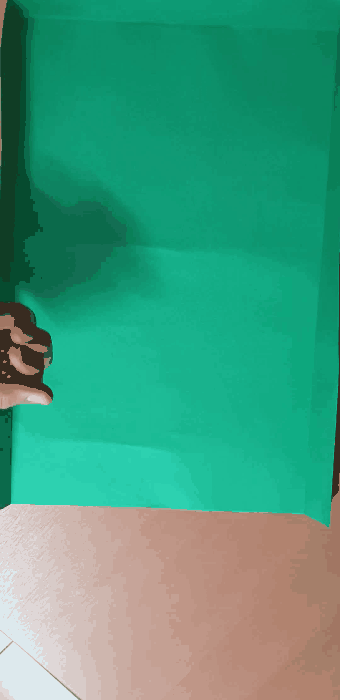
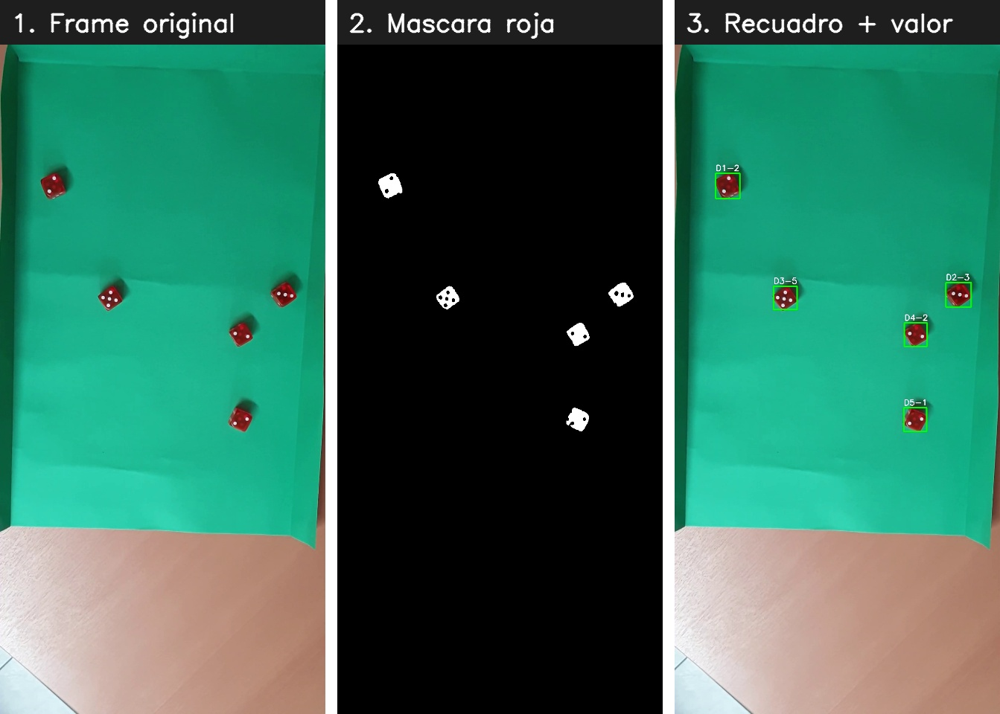
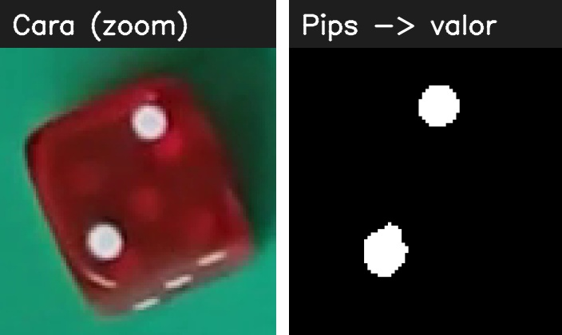

# 🎲 Cinco dados — detección y conteo en video

> Tirás cinco dados, el programa espera a que se queden quietos, **encuentra cada
> uno y lee su valor**, y te devuelve el mismo video con cada dado recuadrado y
> rotulado con su número.

<p align="center">
  
</p>

Todo está hecho con **procesamiento de imágenes clásico** (OpenCV + NumPy): nada
de redes neuronales ni modelos entrenados. Solo color, morfología y componentes
conexas.

---

## La idea en 3 pasos

<p align="center">
  
</p>

1. **Buscar el rojo.** Pasamos el frame a HSV y nos quedamos solo con los píxeles
   rojos del dado. Una limpieza morfológica (apertura + cierre) borra el ruido y
   tapa los puntitos para obtener una mancha sólida por dado.
2. **Separar los dados.** Con *componentes conexas* aislamos cada mancha y la
   filtramos por área, así descartamos reflejos o manchas que no son dados.
   Cuando aparecen 5 manchas válidas, tenemos los 5 dados.
3. **Leer cada cara.** Recortamos cada dado y contamos sus **pips** (los puntos).

## ¿Cuándo están "quietos"?

Los dados se cuentan recién cuando dejan de rodar. Para eso seguimos el
**centroide** de cada dado frame a frame: si un dado se mueve menos de unos pocos
píxeles, le sumamos uno a su contador de "frames quieto"; si se mueve, se
reinicia. Cuando **los 5** llevan varios frames sin moverse, recién ahí leemos
los valores.

> Es un seguimiento por cercanía: cada dado del frame nuevo se empareja con el
> más próximo del frame anterior. Simple y suficiente para esta escena.

## Contar los puntos

<p align="center">
  
</p>

Acá hay un truco lindo: si rellenamos el contorno de la cara del dado y le
**restamos** la máscara roja, lo único que queda son los huecos… que son
justamente los pips. Contamos esos huecos y ese es el valor del dado.

---

## Cómo correrlo

```bash
python -m venv venv
# Windows
venv\Scripts\activate
# Linux / Mac
source venv/bin/activate

pip install -r requirements.txt
python main.py
```

El programa recorre todos los `.mp4` de la carpeta [`videos/`](videos/) y deja
los videos clasificados en [`salidas/`](salidas/), uno por tirada.

## Estructura

| Archivo | Qué hace |
|---|---|
| [`dados.py`](dados.py) | Toda la visión: máscara roja, componentes conexas, seguimiento de centroides y conteo de pips. |
| [`main.py`](main.py) | Orquesta el recorrido de los videos y arma el video de salida. |
| `videos/` · `salidas/` | Entradas y resultados. |

---

<sub>Trabajo Práctico 3 — Procesamiento de Imágenes I · TUIA (UNR / FCEIA). El
informe completo está en <code>Informe TP3.pdf</code>.</sub>
